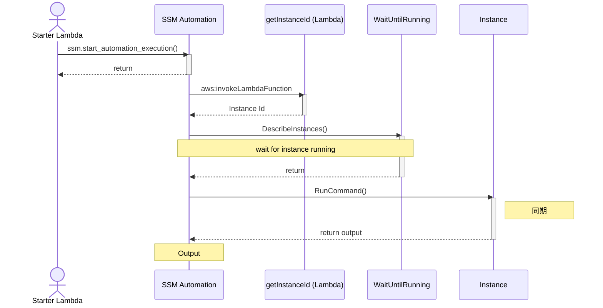

### Events Sequence

```mermaid
sequenceDiagram
    actor Starter Lambda 
    
    Starter Lambda->>SSM Automation: ssm.start_automation_execution()
    activate SSM Automation
    SSM Automation-->>Starter Lambda: return
    deactivate SSM Automation

    SSM Automation->>getInstanceId (Lambda): aws:invokeLambdaFunction
    activate getInstanceId (Lambda)
    getInstanceId (Lambda)-->>SSM Automation: Instance Id
    deactivate getInstanceId (Lambda)
    
    SSM Automation->>WaitUntilRunning: DescribeInstances()
    activate WaitUntilRunning
    Note over SSM Automation,WaitUntilRunning: wait for instance running
    WaitUntilRunning-->>SSM Automation: return
    deactivate WaitUntilRunning
        
    SSM Automation->>Instance: RunCommand()
    activate Instance
    Note right of Instance: 同期
    Instance-->>SSM Automation: return output
    deactivate Instance
    
    Note over SSM Automation: Output
        
```
