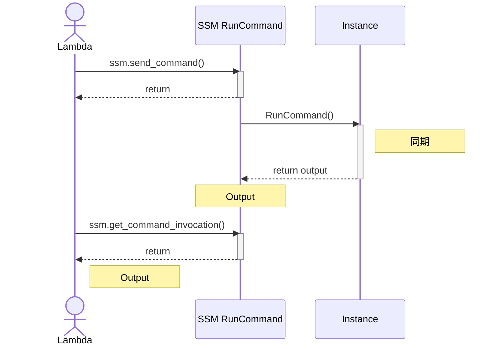
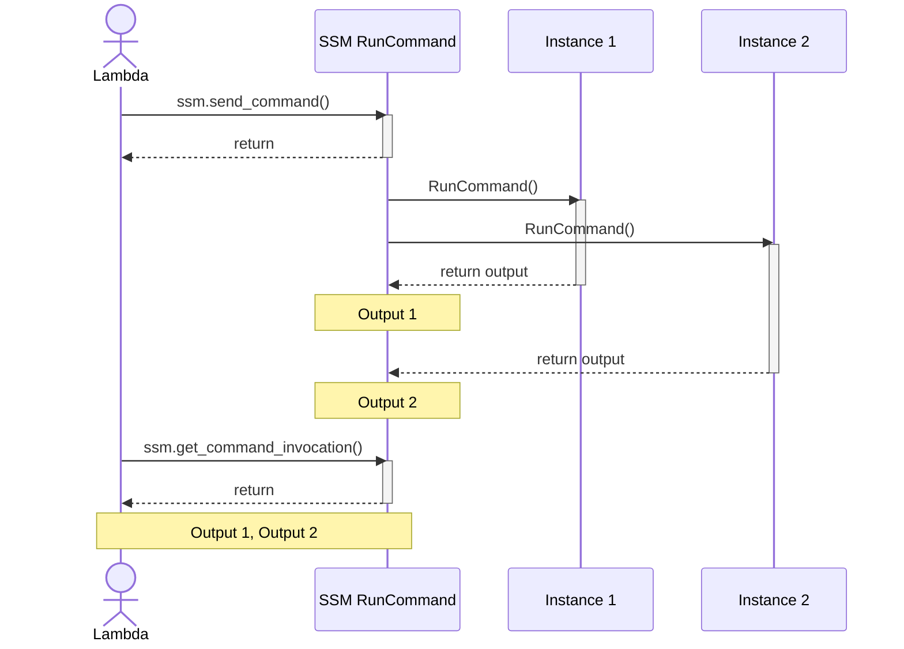

### Events Sequence

```mermaid
sequenceDiagram
    actor Lambda 
    Lambda->>SSM RunCommand: ssm.send_command()
    activate SSM RunCommand
    SSM RunCommand-->>Lambda: return
    deactivate SSM RunCommand
    
    SSM RunCommand->>Instance: RunCommand()
    activate Instance
    Note right of Instance: 同期
    Instance-->>SSM RunCommand: return output
    deactivate Instance
    
    Note over SSM RunCommand: Output
        
    Lambda->>SSM RunCommand: ssm.get_command_invocation()
    activate SSM RunCommand
    SSM RunCommand-->>Lambda: return
    deactivate SSM RunCommand
    Note right of Lambda: Output
```

```mermaid

sequenceDiagram
    actor Lambda 
    Lambda->>SSM RunCommand: ssm.send_command()
    activate SSM RunCommand
    SSM RunCommand-->>Lambda: return
    deactivate SSM RunCommand
    
    SSM RunCommand->>Instance 1: RunCommand()
    activate Instance 1
    SSM RunCommand->>Instance 2: RunCommand()
    activate Instance 2
    Instance 1-->>SSM RunCommand: return output
    deactivate Instance 1    
    Note over SSM RunCommand: Output 1

    Instance 2-->>SSM RunCommand: return output
    deactivate Instance 2    
    Note over SSM RunCommand: Output 2
        
    Lambda->>SSM RunCommand: ssm.get_command_invocation()
    activate SSM RunCommand
    SSM RunCommand-->>Lambda: return
    deactivate SSM RunCommand
    Note over Lambda,SSM RunCommand: Output 1, Output 2
```